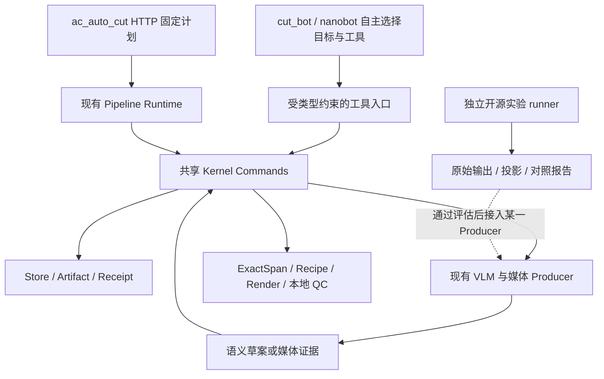

# 13 开源能力吸收：架构与分批实现方案

日期：2026-09-07。代码核查基线：`b23581b9`，分支 `feat/v213-contract-codegen`。
状态：详细设计；本文新增模块、DTO、CLI 参数与实验结果均尚未实现/取得。
本次交付为设计文档，不表示 reference runner 或真实端到端剪辑已经跑通。

## 1. 目标与决策

将 [11 项目调研](./11-open-source-reuse-landscape.md) 的方向转为可逐项实现的能力。
按对当前短剧成片的实际收益排序：叙事与素材匹配、跨窗一致性、可复用的评测、Agent 工具接入、
编辑预览。项目的 S/A 等级代表调研优先级，不代表代码可直接引入，更不代表生产验收。

首轮采用“现有产品内实现窄模块 + 独立上游对照”。可以提取满足许可证的纯函数和模板；
不预先规定必须全部重写，也不整体迁移第三方运行时。是否 fork 某个子项目，由同一数据集上的
质量、接入工作量和维护成本决定。现有 Kernel 也必须参加对照，不能用已有投入证明其质量更好。

近期验收目标仍是 PC WSL 上产出本地视频。外部平台发布不进入这轮范围。
当前 [本地成片与跨 run 复用](../local-render-successor-and-reuse-design.md) 仍是主线，
开源实验不得成为它的新前置条件。

## 2. 再审查发现与纠正

| 现有说明/实现 | 问题 | 本方案采用的设计 |
|---|---|---|
| 11 中 ArtifactBus、`ac_auto_cut Kernel` 用语 | 容易重新引入旧文件总线或把共享包归到 HTTP 项目 | 共用 `packages/autocut-kernel` 的 Store/Command/Receipt；HTTP 与 Agent 都是调用方 |
| 11 将 visual→VAD→ASR 画成串行切点链 | 容易解释成前一层成功即可短路，或假设每种 ASR 都有 word timestamps | 多类证据合取；缺词级时序必须显式声明，最终分别求 video/audio 合法端点 |
| 12 强制所有评测离线，无在线能力即淘汰 | 无法真实比较依赖 VLM 的 VideoAgent/NarratoAI | 区分离线回放与显式预算在线实验，缺录制响应记为未评测 |
| `runner_skeleton.py` 清代理、设 offline 环境变量 | 不能拦截 socket，也没有清除继承的密钥；骨架还抛 `NotImplementedError` | 离线执行采用实际无网络沙箱和白名单环境；当前骨架不算已实现隔离 |
| 12 说较新 fixture 结论覆盖旧结论 | 数据分布改变与算法改善混淆 | 分数据集保留结论，同一冻结样本配对比较，冲突需要分层分析 |
| Lucifer fixture 的剧本和旧 digest 被称为一等 truth | 独立剧本也可能与成片不一致；旧 pipeline 结果不能评自己 | 剧本/API 为参考标签，人工视频核对后才能成为独立金标准 |
| Lucifer 场景 `start_time/end_time` 出现固定 180 秒步长 | 未提供与实际视频对齐的证据 | 暂不进入时间定位评分；核对视频后新增 label revision，不改冻结样本 |
| book 42000021919 fixture 尚有占位问题且 `frozen=false` | 不能用作已完成的对照证据；填 API 不等于标签已验收 | 补输入文件核验、具体问题与视频标注后另冻结；仍可先做运行冒烟 |
| `governance/reuse.yaml` 外部条目是信息登记 | 当前文件未跟踪；注释明确 import gate 不扫描这些外部条目 | 不声称已存在外部依赖机器门禁；引入具体代码时再补精确约束 |

本表纠正文档间的实现含义。11 的用户补充调研保留；12 的实验规则同步修订。

## 3. 两种运行时与共享边界



- HTTP 按用户选择的已注册计划执行，不需要 Agent 决定是否启动或调用哪些阶段。
- Agent 可只做查询、故事设计、某阶段续跑或本地渲染，不强制运行整条流水线。
  它选择目标；程序检查已存在的输入、缺失依赖和预算，执行既有 Command。
- 两者复用同一请求构造、解析、持久化和业务校验。Agent 自身聊天 MessageBus 不保存剪辑业务真相。
- 首版 capability 清单放在工具模块内，以已有 Commands 为来源；不新增通用 DAG 引擎、消息中间件、
  向量数据库或第二套数据库。现有模块能承担的职责不另建服务。
- 外部原始输出可保存用于比较，进入产品后需通过具体阶段的 decoder、投影与业务校验。
  外部工具的 “success” 或 Receipt 仅是执行附件。

## 4. 具体吸收单元和代码落点

以下路径相对本仓库；“拟新增”与“已有”明确区分。参考源码使用已克隆仓库的固定 commit 核查。

| 单元 | 源码/思路来源 | 当前接入点 | 初次交付与取舍 |
|---|---|---|---|
| 叙事片段规划、局部修复 | NarratoAI `app/services/prompts/short_drama_narration/segment_planning.py`、`short_drama_narration_validation.py` | 已有 `semantic_chain/story_design_compact*.py`、`pipeline/*editorial_blueprint*` | 提取叙事承接、用途和错误反馈；保留本项目 VLM 事实输入，去掉上游字幕选时间及强制旁白模板 |
| 意图与能力选择 | VideoAgent `environment/agents/multi.py` 的 intents/tools/graph 生成 | 拟新增 `auto_cut_bot/agent/tools/media_workflow.py`，复用现有工具注册方式 | 首版少量 typed tools 和静态能力表；不修改 `agent/loop.py`，不执行模型生成代码 |
| 语义素材检索 | VideoAgent `tools/videorag/` | 已有 CandidateCatalog 和 frozen WindowContextPack；拟新增 `tools/reuse/videoagent_retrieval/` 实验 | 首先对现有语义对象做检索对照；向量索引有增益再加，检索结果只提供候选引用 |
| 跨窗实体记忆 | MMLVE `video_editing_agent/modules/video_grounder.py`、`entity_keyframe_grounder.py` | 已有 `context_pack/models.py`、`selector.py`；拟新增 `tools/reuse/window_memory/` | 先在离线结果上测身份匹配；后续前缀快照接 Context Pack，不引入 V2V、合成参考人像 |
| 时间证据对照 | FunClip 时间轴/剪辑方法 | 已有 `media/v23_candidate_evidence_window.py`、`auto_cut_bot/pipeline/media_preflight/` | ASR-only 仅作为单独 baseline，实际源仍用 SenseVoiceSmall/FSMN；测截字/吞音，不把 ASR 文本注入 VLM |
| 时间线检查与改动预览 | Timeline Studio / Dawn Cut | 已有 Recipe 和 `pipeline/compile_production_recipe_command.py`；拟新增 `tools/reuse/recipe_preview/` | 先导出只读 timeline.json + 静态预览；编辑应用作为后续功能 |
| 类型化媒体操作 | Kinocut inspect/preflight/result 形态 | 已有 `pipeline/render_local.py`、rendering adapters | 检查现有入口是否缺能力，缺一项才补一项；暂不部署第二个 FFmpeg MCP 服务 |
| 使用说明与 debug 浏览 | video-highlight-skill | 已有 `auto_cut_bot/pipeline/debug/model_io.py` | 复用分阶段 debug 和本地结果页结构，Skill 可调用 typed tool，不另写生产剪辑脚本 |

NarratoAI 的上游提示词真实要求字幕输入、旁白与原声交替；直接复制会改变本项目产品行为。
这里吸收的是故事规划和局部错误反馈方法，旁白/TTS 必须是后续独立产品选项。
MMLVE 的研究任务是生成式多镜头编辑；本项目仅评估其中的实体观测/连续性机制，不能沿用其生成质量指标声称剪辑质量提高。

## 5. Agent 接入：计划可检查，执行沿用现有命令

拟新增的工具面只需三项：

| 工具 | 输入 | 输出/行为 |
|---|---|---|
| `media_inspect` | job_ref、可选 episode/story selector | 当前确切 Artifact refs、阶段状态、可用能力和缺少依赖；只读 |
| `media_plan` | 用户意图、inspect snapshot、目标阶段、预算 | `MediaIntentDraft/v1` 和程序解析的计划差异；不运行模型之外的业务工作 |
| `media_execute` | 已检查的 plan_ref、预期 revision | 按已存在 Command 调用；返回具体 Receipt refs，不以工具返回字符串代表全流程成功 |

这些是拟议新工具名，并非当前已注册 API。`MediaIntentDraft/v1` 的模型字段：
`goal`（inspect/analyze/design/render_local）、`episode_aliases`、`story_aliases`、
`preferences`（语言/目标时长/风格，受已提供选项限制）。模型不生成命令名、owner、hash、SQL 或物理端点。

程序生成 `ResolvedMediaPlan/v1`：

| 字段 | 必需性/来源/用途 |
|---|---|
| `schema_version` | 常量，由程序生成 |
| `job_ref`, `base_revision` | 必需，来自 inspect；执行前比较当前计划修订 |
| `capability_catalog_hash` | 必需，绑定本次使用的工具与请求版本 |
| `nodes[]` | 程序按能力依赖构造 DAG；每项为 node_id、capability_id、input_refs/input_links、depends_on |
| `input_refs` | 已提交数据的完整 refs；模型不回显 |
| `input_links` | 同计划上游 node + 注册输出槽位；完成后解析到具体 refs，不能预造 Receipt |
| `budget` | provider 调用/token 上限和资源限额，由用户配置和现有命令策略共同约束 |
| `plan_hash` | 规范化请求语义与以上依赖计算，不包含日志时间戳 |

解析顺序：验证意图字段→解析短 ID→查 capability→确认输入类型/来源→补缺失节点→拓扑检查→
生成计划。未知工具、成环、跨 Job 引用返回具体错误；必要阶段没有输入时记为依赖未满足。
不靠额外 LLM“审图”证明合法，LLM 可提供创作建议但程序独立检查。

运行中的计划保留修订。重新规划新增 revision，仅使受改变输入影响的节点失效；已成功且兼容的节点复用。
执行器先持久化 node→Command key 绑定再发起调用；超时沿同一 key 查询/恢复。
仅在已确认失败且输入或策略改变时生成新节点身份，防止每次反思清空重试预算。
并行仅限依赖满足的独立节点，受已有全局资源并发限制；单集失败不撤销其他已成功集，
全批完整性仍由目标 batch finalizer 判断。普通无人流程没有强制人工批准节点。

## 6. 叙事与检索：丰富语义，减少重复抄写

### 6.1 本轮不增加生产 VLM 输出负担

继续由 VLM 生成现有丰富实体、事实、事件、字幕观察与高光候选，保留 [07 parity](./07-v23-field-parity-and-external-references.md)。
Stage 2 接收已实现的 compact 模型视图；全长引用和事实并集仍由程序恢复。
将 NarratoAI 的“困境→冲突→变化→阻力→悬念”作为可选叙事组织策略，不强制每条故事具有相同模板。
收益先用固定旧 VLM 输出测试；切换 Stage 2 提示词只重跑 Stage 2 及其受影响后续，不能触发 VLM 全量重跑。

### 6.2 检索实验契约

`RetrievalQuery/v1`：query_id、用户需求、允许的 source/episode refs、已知截止范围、top_k、index_manifest_ref。
`RetrievalHit/v1`：query_id、rank、原 candidate/event ref、粗 support 区域、score、reason。
score 仅在该实验排序中有意义，不能作为跨模型统一置信度或 Admission 分数。

首版索引现有 entity/event/candidate 的摘要和关联，文本关键词检索作为低成本 baseline。
需要语义 embedding 时，以已冻结对象文本和固定模型构建可重建索引；不回头读取 API 最新数据。
索引 manifest 绑定输入对象 refs、embedding 模型、文本投影版本与索引参数；命中后重读源对象验证归属。
不能通过索引命中新增事实；若要将排序用于 Stage 2，必须让输入预算、候选集合及截断记录进入新请求版本。

### 6.3 错误反馈和预算

程序错误、机械 enum 规范化、JSON 结构错误、引用错误、故事不可行分开处理。
反馈仅携带 JSON path、对象别名、合法选项、约束和必要局部上下文。
完整响应保留 raw；局部修复后的草案仍整体重新校验，不用删除失败材料凑通过。
一次 Command 拥有重试预算；provider SDK 不再独立验证重试。结果不明先恢复，不能换 key 盲发。

## 7. 跨窗 Memory：先观察并行，再逐前缀增强

首版做 A/B 两条实验路径：A 为现有独立窗口结果；B 在相同结果上增加跨窗实体匹配。
这一步不再调用 VLM，可测同人拆分、异人合并和重复事件。
只有匹配有明确增益，再做第二轮 Context Pack 增强 VLM；需要新的模型请求身份和受限在线预算。

拟新增 `WindowMemorySnapshot/v1`：

| 字段 | 产生方式与约束 |
|---|---|
| `source_set_ref`, `source_window_refs` | 引用已提交观察；不读取 latest head |
| `known_until` | episode + window 在原 source census 的顺序，非文件名推测 |
| `parent_snapshot_ref` | 可空，构成前缀链；禁止引用当前/未来窗口 |
| `entity_cards[]` | entity ref、视觉特征、已知别名、last_seen、match hypothesis；未知身份可独立保留 |
| `open_event_refs`, `contradictions[]` | 前缀窗口已有对象的引用，不由全剧结局反推 |
| `selection_policy_ref`, `selected_refs`, `omitted_refs` | 确定性预算选择及省略原因；截断可见 |
| `content_hash` | 绑定上述内容和版本；模型看短别名，完整 refs 留 envelope |

构造 snapshot 的候选匹配可使用视觉/文本特征；程序只校验匹配依据，不把相似度变成身份事实。
API 人物资料与视频观测分组，使用 `known_from_episode` 限制，字幕文字仍由 VLM 读取。
API/剧本未在成片出现的情节不能借 snapshot 注入 observed claims。

重跑窗口 N：N 之前快照复用，N 之后依赖它的快照及增强请求标记待重建；不立即付费重跑。
独立基线窗口不依赖 memory，可继续并行。增强窗口的前缀依赖真实存在，不能宣称任意并行且完全等价。
输入预算由已有 ContextSelectionPolicy 扩展控制，先保留当前集实体/未完成事件，再选历史资料；
任何新排序/省略策略单独版本化，与历史 Context Pack 严格区分。

## 8. 精切与可编辑结果

```text
VLM Candidate 粗区域
  + Transcript/SenseVoice 的可用时间粒度和完整性
  + FSMN SpeechActivity
  + Frame/Shot/Visual/Subtitle clearance 证据
        → 可行 video 端点集合、可行 audio 端点集合
        → ExactSpan A/V pairing → Recipe → Render → 本地 QC
```

上述证据合取而非成功短路。ASR 没有 word timestamps 时显式标记粒度；不能凭句子时间均分出词。
VLM 读到的字幕文本可用于语义，字幕可见区间安全证据和精切另行校验。
FunClip 的 baseline 可以在隔离实验内用其转录选择片段，但该文本不流入生产 VLM prompt。

Review UI 首版只读：Recipe ref、source spans、独立音视频轨、字幕/BGM（存在时）、QC 问题与预览位置。
导出时间单位保留整数 tick + time_base。用户拖动后暂存 `EditProposal/v1`：
base_recipe_ref、base_revision、edit_ops、reason；第一批 edit_ops 只允许更换已知候选 variant、调整顺序、
显式请求重编译某个 span。不能在 UI 保存未经编译的浮点时间为权威 Recipe。
应用时用 CAS 检查 base_revision，重新编译受影响 Recipe 并跑相关 QC，产生新 revision。
旧 Render 可回看，新 QC 完成前不会覆盖本地已接受产物。
人工编辑是可选入口，Pipeline 自动运行不等候人工操作。

## 9. 实验运行与持久化设计

### 9.1 两种执行模式

- `replay`：默认零 provider 调用。仅用预录 request/raw response、冻结媒体和已安装模型资源。
  回放必须按原请求 hash 命中；变更 prompt 后不能继续用旧响应冒充新策略结果。
  缺录制数据为 `not_evaluated/replay_miss`，不判项目不可用。
- `live`：明确实验配置中的 provider、模型、最大调用数、最大输入/输出 token、预算和并发；
  由宿主受限 provider adapter 发请求，外部子进程只接收本次响应，不能拿到继承的全量环境。
  可先按服务端 output 上限和已知输入估计预留预算；价格未知时金额留空，调用/token 上限仍生效。

`replay` 的真正断网由容器 `--network=none` 或可核验的 Linux network namespace 完成，
输入和参考源码只读挂载，输出目录独立可写。清代理/设置 HF_HUB_OFFLINE 只是额外配置。
无法提供隔离时不声明“安全离线已验证”，可继续做源代码/纯函数静态评估。
在线模式只开放宿主 adapter 所需通道。所有本轮真实模型与重媒体实验在 PC WSL；代码经 Git 同步。

### 9.2 最小文件合同（拟新增，暂不建数据库表）

| 文件 | 主要字段及用途 |
|---|---|
| `tools/reuse/projects.json` | 各项目 repo_url、commit、license_path、选取文件、adapter_version、评估状态；详细登记独立于旧 closed governance schema |
| `ExperimentSpec/v1` | fixture_ref/hash、producer commit、adapter hash、variant、mode、model/request settings、budget、seed（支持时）、metric policy；冻结实验计划 |
| `FixtureManifest/v2` | 稳定相对路径/内容 hash、episode 映射、媒体时长、labels_ref、label_kind、alignment_status、allowed_context_refs；私有 root 映射不计身份 |
| `metadata.json` | spec_hash、实际代码/环境版本、起止时间、实际模式、status、error_code、resume refs |
| `calls/<id>/` | request.json、raw_response、provider response id、usage、终态；密钥不落盘 |
| `projection/*.json` | 原 raw hash、投影版本、业务字段、无法映射项；原输出永不覆盖 |
| `metrics.json` | 指标定义/值/样本数/分母/缺失原因、按剧/情形分组的结果、预算与资源统计 |
| `report.md` | 同一样本上的收益/退化、适用范围、实现建议，引用上述文件 hash |

拟 CLI：`tools/reuse/run.py --spec <json> --mode replay|live --media-root <private-dir>`；
resume 必须显式选择原 experiment id 并核对 spec_hash，每次尝试新增 attempt 子目录。
外部结果/原视频保留在私有 artifacts/shadow 下，Git 保存 runner、脱敏 spec、结果摘要和源码引用。
完整路径以已解析 project root 为准，不再依赖骨架被复制到几层目录的 `parents[3]`。

实验阶段不写 Kernel DB。模块晋升为产品能力时扩展相应阶段的 versioned DTO/Artifact 并通过
已有 Command 提交；需要新业务 Artifact 类型时同批定义 writer、reader、重放和依赖失效，
不把任意 shadow 文件直接转换成成功 Receipt。

## 10. 数据标注与比较方法

`label_kind` 分为 `video_verified`、`external_script_reference`、`api_reference`、`pipeline_baseline`。
只有视频核对过且未提供给被测模型的标签用于主质量评分；剧本/API 用于辅助核对，旧模型输出用于一致性对照。
同一 API 内容既作为 Context 又作为答案时，单独报告 context-copy 测试，不计独立理解准确率。
模型裁判可以辅助定位问题，不能独立担任最终标签生成器和质量证明。

首批取现有两集 Lucifer 和 book 42000021919 的前三集，按真实视频核对字幕、实体、关键事件及时间区间。
Lucifer 现有 frozen 文件保留，新标注写新 set/revision；第二组 pending fixture 未准备好前只做 smoke。
sample smoke 可以早于人工全量标注，产物明确 `quality_not_evaluated`。

| 指标 | 可执行定义 | 使用限制 |
|---|---|---|
| 事件/高光 Recall@K | 每个问题独立相关集合 R，top K 中去重命中数 / count(R)；匹配规则预先冻结 | R 为空不作 0/0；没有标签为 null；不能用命中条数代替召回率 |
| 角色连续性 | 同人配对 precision/recall、异人误合并率，按换装/遮挡/无字幕分组 | 不只比较名字字符串 |
| 事实与字幕质量 | 独立核对的 claim 支持率、关键字幕漏读/误读及说话人归属错误 | 从字幕读到名字不等于视频确定说话人 |
| 故事完整性 | 必须保留的 setup/payoff/转折是否出现，盲评叙事可理解度 | schema 与引用闭合只算结构指标 |
| 切点质量 | 目标片段截字/吞音/字幕残留/黑白屏次数及分母，双盲 A/B 成片比较 | 没有合法时间标签不做 IoU；语义召回不能替代此项 |
| 成本/性能 | 实际 input/output/cached token、调用数、重试数、总耗时、峰值 GPU/内存 | replay 的本次 token 为零，录制时成本另列；不把估计价格称实付 |

先同模型/相同可见信息做机制 A/B，再比较上游原生系统。后者可能使用额外 ASR、模型或 TTS，
必须记录差异，不能把额外信息带来的增益归功于规划算法。至少按一部剧调参、另一部剧留出验证。
冻结接受准则后才跑留出集；不预设拍脑袋的统一“90%”。小样本报告原始计数，不能外推可靠率。
上线要求：对应必要结构/切点案例通过，目标质量指标有可复核改善且无超过预设容忍度的退化，
成本在预算内；不满足则保留实验报告，产品默认策略不切换。

## 11. 实施任务与依赖

以下 R 编号仅是本吸收方案工作包，不替代 06–08 的 Global Phase；本文未创建或启动这些实现任务。
逐阶段的文件、DTO、执行流程、测试和退出条件见
[实施阶段索引](../open-source-adoption-phases/README.md)。

| 包 | 范围/产出 | 依赖 | 验收 |
|---|---|---|---|
| [R0 实验可执行性](../open-source-adoption-phases/00-r0-experiment-foundation.md) | 修 runner root/环境隔离/固定引用；ExperimentSpec、Fixture v2、保留 raw/usage/resume | 无 | 无密钥继承、replay 零调用、缺录制有明确状态、文件 hash 校验；1 个假 provider 可完成协议 smoke |
| [R1 叙事策略](../open-source-adoption-phases/01-r1-narrative-strategy.md) | NarratoAI 启发的 Stage 2/3 strategy 实验，复用真实已保存 VLM | R0；真实上游可重读 | 同样输入的 A/B 报告；局部重跑不触发 VLM；不强制新增旁白 |
| [R2 跨窗记忆/检索](../open-source-adoption-phases/02-r2-window-memory-retrieval.md) | VideoAgent 检索 + MMLVE 实体关联两个独立 runner | R0；独立标签 | 无未来信息、标签不泄露、漏检/误合并有分母；收益通过后才做 Context Pack 新版本 |
| [R3 Agent 工具](../open-source-adoption-phases/03-r3-agent-tools.md) | inspect/plan/execute、小型 capability 表、节点→Command 绑定 | 可复用的现有命令 | Agent 单阶段调用、HTTP 不依赖 Agent、相同业务输入的结果与恢复语义一致 |
| [R4 Recipe 预览](../open-source-adoption-phases/04-r4-recipe-preview.md) | 只读 timeline 与 diff；后续 EditProposal→CAS→新 Recipe | 已有真实 Recipe/本地 Render | 时间映射正确、无 UI 私有写路径；编辑并发冲突不覆盖旧 revision |
| [R5 产品接入](../open-source-adoption-phases/05-r5-product-integration.md) | 只对 R1/R2 验证有益的模块接相应 stage，选择性 Kinocut/FunClip 适配 | 对应实验通过；当前本地成片主线就绪 | 1 部真实剧局部重跑至本地成片、完整 debug、旧 run 可查询、默认回退可执行 |

执行顺序：R0 后 R1/R2 可并行；R3 可独立做现有工具盘点，R4 可先设计只读投影。
同一时间 `context_pack/selector.py`、请求构造器、Store 文件只安排一个实现者，其余用 fixtures 对接。
第一批实际开发只做 R0 + R1 的最小样本，先得到质量证据；不一次铺开八个项目的 adapter。

### 失败与改动只影响必要范围

| 改动/失败 | 重跑范围 |
|---|---|
| 报告格式、UI 展示、非行为代码 | 重新生成报告/前端；模型和媒体产物复用 |
| 合法无序枚举排序策略 | 本地版本化 reprocess，0 模型调用 |
| Stage 2 提示词、叙事排序策略 | 新 Stage 2 请求及其后续；旧 VLM/Stage 1 满足兼容性才复用 |
| 前缀 memory 内容/选择策略 | 受影响增强窗口及依赖节点；先展示重算计划，不自动全剧调用 |
| media renderer 参数 | 受影响 Recipe/Render/QC；不使 VLM 失效 |
| 在线超时且结果不明 | 同一 request/attempt 状态恢复，不另开隐藏 retry |

缓存与复用引用沿用 [local-render successor](../local-render-successor-and-reuse-design.md) 的
“内容兼容、目标授权、来源证明”区分；不要新建一套跨平台缓存权威。禁用某实验默认策略不删除
已写 Artifact 的 reader；回退影响新请求，历史记录仍保留。

## 12. 设计复核与一手证据

本轮为主代理源码/文档交叉核对，未声称外部双模型批准，也未执行上游项目或真实模型。
已检查的对抗案例：API 答案泄露、未来关系污染、ASR 无词级时间、同名异人、缓存错绑新 prompt、
两个执行器重复提交、在线响应未知、旧 fixture 被新版覆盖、部分批次误称成功；解决位置分别见 §5–11。

重点源码快照：

- [VideoAgent multi.py](https://github.com/HKUDS/VideoAgent/blob/f207987e3cffb554aaa6ffdbe733efb30f4b51ed/environment/agents/multi.py)：意图选择、工具图生成与交互执行，作为编排研究来源。
- [NarratoAI segment_planning.py](https://github.com/linyqh/NarratoAI/blob/9fc6223f0ab816e9a237e7e1d09e16a0ab905312/app/services/prompts/short_drama_narration/segment_planning.py)：基于剧情/字幕规划叙事片段，不能原样变成本项目 VLM prompt。
- [NarratoAI validation](https://github.com/linyqh/NarratoAI/blob/9fc6223f0ab816e9a237e7e1d09e16a0ab905312/app/services/short_drama_narration_validation.py)：局部时间与脚本检查的参考。
- [MMLVE VideoGrounder](https://github.com/Wucy0519/MMLVE/blob/596ebb23d5bf15c04259dd71367008c923d3f425/video_editing_agent/modules/video_grounder.py)：分镜分析、实体观测和持久化检查点的参考。
- [FunClip](https://github.com/modelscope/FunClip/tree/2a954d4fbad6a57a5271390be4eb43f80d201b60)、[Timeline Studio](https://github.com/MartinDelophy/ai-video-editor/tree/68980d142cce421eab86cd4ef26a4475a6affd56)、[Kinocut](https://github.com/KyaniteLabs/kinocut/tree/999dd40000749e3a9dc34fb4090e6adabc9213a4)、[Dawn Cut](https://github.com/kwakseongjae/dawn-cut/tree/7de68fce41505d8092ec227806b8d4bea4127675)：保留固定参考提交，具体提取文件在对应 R 包中确认。

这些快照说明设计来源，不声称是最新提交或已完成全部许可审计。引入实际代码时保留版权、修改记录，
核对选定文件和模型的许可证。11 中动态 star/发布日期与“生产级”称谓未经本轮逐项验证，不作为选型验收依据。
