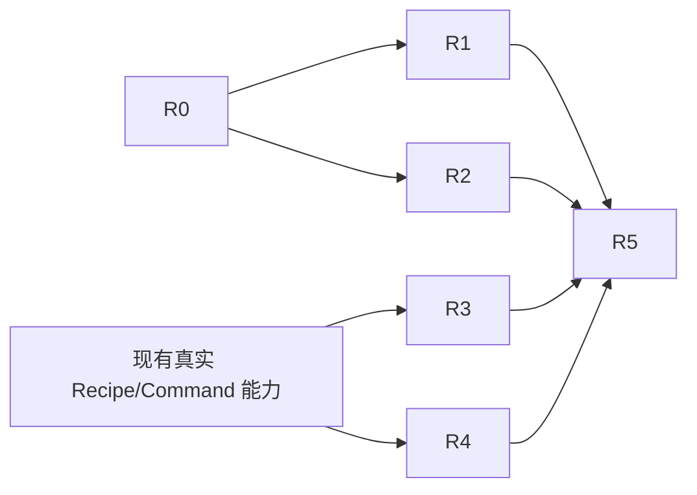

# 开源能力吸收实施阶段

本目录细化 [总体设计](../llm-stage-contracts/13-open-source-adoption-architecture.md) 的 R0–R5。
所有内容均为实现规范；只有对应文档的退出条件取得证据并记录提交后，阶段才算完成。

| 阶段 | 结果 | 可并行性 | 生产行为变化 |
|---|---|---|---|
| [R0 实验底座](./00-r0-experiment-foundation.md) | 可复现 replay/live runner 和可信 fixture | 首先完成 | 无 |
| [R1 叙事策略](./01-r1-narrative-strategy.md) | NarratoAI 启发的 Stage 2/3 A/B | 可与 R2 并行 | 验收前无 |
| [R2 记忆与检索](./02-r2-window-memory-retrieval.md) | 跨窗实体关联、语义检索、可选 Context v2 | 可与 R1 并行 | 验收前无 |
| [R3 Agent 工具](./03-r3-agent-tools.md) | inspect/plan/execute 调用共享 Runtime | 可先盘点，执行依赖稳定 Command | 新增可选 Agent 入口 |
| [R4 Recipe 预览](./04-r4-recipe-preview.md) | 只读时间线及受控修订 | 依赖真实 Recipe | 新增可选预览/修订入口 |
| [R5 产品接入](./05-r5-product-integration.md) | 通过验证的模块接入 HTTP/Agent 并跑本地成片 | 最后执行 | 显式 profile 切换后生效 |

统一规则：HTTP Pipeline 不依赖 Agent；Agent 和 HTTP 调用同一 Kernel Command；开源实验不写权威
Store；ASR/VAD 只提供物理时序；VLM 继续承担视频语义与画面字幕理解；任何阶段失败只使其依赖后继失效。
每个阶段使用独立提交和验收记录；可以提前做不依赖前序的代码盘点，但不能提前宣布后序阶段完成。
